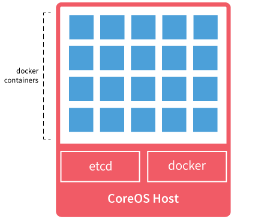
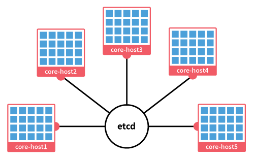

.. image:: images/docker.png
    :align: right
    :width: 250px

======
Docker
======

Why docker
==========

.. sidebar:: about

    - Since March 2014
    - Use go language
    - Use native cpu/syscall/kernel
    - Use namespace/capabilities/ctrlgroup/apparmor/netfilter
    - Use ipc namespace communicate between containers
    - Require libcontainer/lxc/libvirt/systemd-nspawn
    - Managed by DGAB (Docker Governance Advisory Board)
    - Containers don't aim to be a replacement for VMs, they are complementary in the sense that they are better for specific use cases.

It's an open source container application engine. Portable and easy to deployment.

* Advangtages
    - compare to kvm use virtio, docker use AUFS, which is better.
    - light weight 'vm', use less mem than kvm, closer to BM
    - will not be install into host OS
    - each container owns a set of env
* Constrains
    - 64bit platform
    * must have same OS kernel
    * kernel 3.8 is minimal, except rhel **2.6.32** . So, 3.10(ubuntu 1404 trusty) or higher is recommended
    * can't over commitment
    * v1.10 can't modify files under /etc, v1.20 solved this issue (mount | grep etc)
    * network buttleneck
    * no time namespace

Underlying Technologies
-----------------------

Namespaces

============ ========== ======================
namespace    kernel     isolation
============ ========== ======================
mount        2.4.19     mount point / fs
uts          2.6.19     host name & NIS domain name
ipc          2.6.19     ipc resources
pid          2.6.24     process id space
network      2.6.29     network resources
user         3.8        user & group id
============ ========== ======================

    
Getting started
---------------

.. sidebar:: Note

    - docker not work well w/ proxy, so here is a workaround: ``service docker stop; docker -d &``
    - docker container not work well w/ proxy, add **key-values** of proxy server before cmds which need proxy
    - wrapped up in a function so that we have some protection against only getting half the file during "curl | sh"

Configuration files
^^^^^^^^^^^^^^^^^^^

- ``/etc/default/docker`` -- Docker Upstart and SysVinit configuration file(ubuntu)
    - location of docker binary, daemon startup opts, proxy, tmpdir
    - can work with export or any other cmds
- ``/etc/sysconfig/docker`` -- Docker configuration file for centos/fedora/redhat
    - parameters(key-value pair) only 

Install Docker
^^^^^^^^^^^^^^

.. code-block:: bash
        
    # require root user
    wget -qO- https://get.docker.com/ | sh
    curl -sSL https://get.docker.com/ | sh
    wget -qO- https://test.docker.com/ | sh   # test verison

Update Dockera
^^^^^^^^^^^^^^

.. code-block:: bash

    sudo wget https://get.docker.com/builds/Linux/x86_64/docker-latest -O /usr/bin/docker
    sudo chmod a+x /usr/bin/docker

Docker users
^^^^^^^^^^^^

If you would like to use Docker as a non-root user, you should now consider
adding your user to the "docker" group with something like::

    sudo usermod -aG docker your-user

Basic Commands
==============

Container Management
--------------------

.. sidebar:: Note

    - detach a instance ``^p^q``

.. code-block:: shell
    :linenos:

    docker run [-v [hostpath:]path[:mountopts]] [-itd] [--rm] [--name cname] [--volumes-from <container>] <image> CMD
    docker ps [-aq] [--no-trunc]
    docker kill <container>
    docker stop<container>
    docker inspect [-f, --format <format>] <container>
    docker rm <container>
    docker exec <container> CMD
    docker attach <container>
    docker stats <container>
    docker top <container>

Image Management
----------------

.. sidebar:: About tags

    same image can have multiple tags, eg:
    ubuntu, ubuntu:trusty, ubuntu:latest, ubuntu:14.04

.. code-block:: shell
    :linenos:

    docker images [-aq] <image>
    docker search <image>
    docker rmi <image>
    docker history [-q] [--no-trunc] <image>
    docker build [-f build-file] [-t tag] .

tricks
------

.. code-block:: shell
    :linenos:

    # get backgound container id
    cid=$(docker run -itd)
    nid=$(docker inspect -f '{{.NetworkSettings.IPAddress}}' $cid)
    docker exec $cid <CMD>
    # clean docker containers
    docker kill $(docker ps -q) && docker rm $(docker ps -qa)
    # exec cmd one time through container
    docker run --rm --volumes-from john1 -v $(pwd):/backup busybox tar cvf /backup/john2.tar /john1

Dockerfile
==========

Instructions
------------

- ``FROM``
- ``RUN`` -- commad to change the base image, can exec multiple cmds via \\ and && ::

    RUN \
      apt-get update && \
      apt-get -y install apache2

- ``CMD`` -- default commands when container launched
- ``ADD`` -- move copy file from current dir to container ::

    ADD index.html /var/www/html/index.html

- ``EXPOSE`` -- container's port to be exposed ::

    EXPOSE 80

- ``VOLUME`` ["/data"]-- create a mount point ::

    VOLUME ["/var/www/html"]

- ``MAINTAINER``
- ``ENV REFRESHED_AT``
- ``ENTRYPOINT``
    

Caching
-------

by default build use cache

.. code-block:: shell
    :linenos:

    docker build -f <dockerfile> -t <tag> .
    docker build --no-cache=true -f <dockerfile> -t <tag> .

Network Management
==================

.. image:: images/docker_swarm.png
    :align: right
    :width: 200px

`libswarm <https://github.com/docker/swarm>`_
-------------------------------------------

It's a small toolkit, for docker network settings. Defines a standard service interface, for communications between service module in distributed operation system.

`pipwork <https://github.com/jpetazzo/pipework>`_
-------------------------------------------------

Software-Defined Networking for Linux Containers

container in kvm
================

like coreos, intel clear linux or any other light weight linux work with container in hybrid mode.
- can take both the advangtages of kvm and container

`CoreOS <https://coreos.com>`_
-----------------------------

- Open Source project for linux containers
- Linux for massive server deployment
- Started a project **rocket** , claimed simpler, lighter and much secure than docker

`Kubernetes <http://kubernetes.io>`_
------------------------------------

It's an open source orchestration system for Docker containers, open-sourced by google

Issues
======

1. FATA[0000] -- permission denied

.. code-block:: console

    FATA[0000] Get http:///var/run/docker.sock/v1.18/containers/json: dial unix /var/run/docker.sock: permission denied. Are you trying to connect to a TLS-enabled daemon without TLS? 

| **solution**

.. code-block:: bash

    sudo groupadd docker
    sudo usermod -aG docker stack   # stack is our current user
    then relog in to current user

