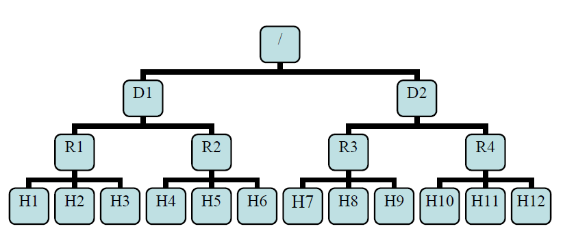

===========================
Hadoop Configuration Tuning
===========================

.. `DoopShot <https://github.com/JetChars/hadoopshot>`_ - Automatic Conf & Analysis Tool
=====================================================================================

.. In order to simplify hadoop tunning process, I've started this project with my friend `Xinni <https://github.com/irisayame>`_.
.. This tool has helped us with configurating hadoop, extracting system info and collecting datas, as well as analyzing results.

Rack Awareness
==============

Typically large Hadoop clusters are arranged in racks and network traffic between different nodes with in the same rack is much more desirable than network traffic across the racks. In addition NameNode tries to place replicas of block on multiple racks for improved fault tolerance. Hadoop lets the cluster administrators decide which rack a node belongs to through configuration variable ``net.topology.script.file.name``. When this script is configured, each node runs the script to determine its rack id. A default installation assumes all the nodes belong to the same rack. This feature and configuration is further described in PDF attached to `HADOOP-692 <https://issues.apache.org/jira/browse/HADOOP-692>`_

* distance(/D1/R1/H1,/D1/R1/H1)=0  same datanode
* distance(/D1/R1/H1,/D1/R1/H2)=2  same rack different datanode
* distance(/D1/R1/H1,/D1/R1/H4)=4  same DataCenter different rack
* distance(/D1/R1/H1,/D2/R3/H7)=6  different DataCenter

Assumption
----------

Bandwidth in/out of a subtree may be less than the total bandwidth of machines within the subtree.

Replica Placement
-----------------

The block replica placement policy is intended to get a tradeoff between ``minimizing the write cost`` and ``maximizing data reliability and availability, and aggregate read bandwidth``.

Creating New Block
^^^^^^^^^^^^^^^^^^
* First replica on local node
* Second replica on different node at same rack
* Third replica on different node at different rack
* Other replicas follow the rules below
    * Each node has at most one replica
    * If replicas are less than racks*2, no more than 2 replicas on the same rack

Replicate Existing Block
^^^^^^^^^^^^^^^^^^^^^^^^
* If one replica exists, put 2nd replica on different rack
* If two replicas on same rack, put 3rd replica on different rack
* If two replicas on different racks, put 3rd replica on the same rack with replica 1
* If there are more than 3 available replicas, then put other replicas randomly.

Topology Script
---------------

* Add parameter ``net.topology.script.file.name`` to **core-site.xml**

.. raw:: html

   

*Note* :

The script name that should be invoked to resolve DNS names to NetworkTopology names. Example: the script would take host.foo.bar as an argument, and return /rack1 as the output.

.. raw:: html

   

* Write script file

*Sample c script*

.. code-block:: c
    :linenos:

    int main(int argc , char *argv[]){
        for(int i=1 ;i< argc; i++){
            char* ipStr = argv[i];
            cout<<"/rack1/"<<i<<" ";
        }
        cout<< endl;
    }

*Sample python script*

.. code-block:: python
    :linenos:

    import sys
    from string import join
      
    DEFAULT_RACK = '/default/rack0';
    RACK_MAP = { '10.72.10.1' : '/datacenter0/rack0',
    '10.112.110.26' : '/datacenter1/rack0',
    '10.112.110.27' : '/datacenter1/rack0',
    '10.112.110.28' : '/datacenter1/rack0',
    '10.2.5.1' : '/datacenter2/rack0',
    '10.2.10.1' : '/datacenter2/rack1'
    }
    
    if len(sys.argv)==1:
        print DEFAULT_RACK
    else:
        print join([RACK_MAP.get(i, DEFAULT_RACK) for i in sys.argv[1:]]," ")

*Sample bash shell script*

.. code-block:: shell
    :linenos:

    HADOOP_CONF=/etc/hadoop/conf
    
    while [ $# -gt 0 ] ; do
        nodeArg=$1
        exec< ${HADOOP_CONF}/topology.data 
        result=""
        while read line ; do
            ar=( $line ) 
            if [ "${ar[0]}" = "$nodeArg" ] ; then
                result=”${ar[1]}”
            fi
        done 
        shift 
        if [ -z "$result" ] ; then
            echo -n "/default/rack "
        else
            echo -n "$result "
        fi
    done

Topology data ::

    hadoopdata1.ec.com     /dc1/rack1
    hadoopdata1            /dc1/rack1
    10.1.1.1               /dc1/rack2

Check whether rack awareness is enabled
---------------------------------------

Check hdfs topology info
^^^^^^^^^^^^^^^^^^^^^^^^

.. code-block:: shell
    :linenos:

    $ hadoop dfsadmin -report
    Name: 172.16.0.4:50010 (172.16.0.4)
    Hostname: r16s04
    Rack: /dc1/rack16

Check replica placement
^^^^^^^^^^^^^^^^^^^^^^^

.. code-block:: shell
    :linenos:

    $ hdfs dfs -cat /HiBench/benchmarks/TestDFSIO-Enh/_merged_reports.txt
    /HiBench/benchmarks/TestDFSIO-Enh/io_write/part-00000 414033800 bytes, 4 block(s):  OK
    0. BP-2107384216-192.168.16.3-1432011436876:blk_1073752772_11948 len=134217728 repl=3 [/dc1/rack16/node2/172.16.0.2:50010, /dc1/rack16/node3/172.16.0.3:50010, /dc1/rack16/node4/172.16.0.4:50010]
    1. BP-2107384216-192.168.16.3-1432011436876:blk_1073752773_11949 len=134217728 repl=3 [/dc1/rack16/node3/172.16.0.3:50010, /dc1/rack16/node1/172.16.0.1:50010, /dc1/rack16/node2/172.16.0.2:50010]
    2. BP-2107384216-192.168.16.3-1432011436876:blk_1073752774_11950 len=134217728 repl=3 [/dc1/rack16/node2/172.16.0.2:50010, /dc1/rack16/node3/172.16.0.3:50010, /dc1/rack16/node4/172.16.0.4:50010]
    3. BP-2107384216-192.168.16.3-1432011436876:blk_1073752775_11951 len=11380616 repl=3 [/dc1/rack16/node2/172.16.0.2:50010, /dc1/rack16/node1/172.16.0.1:50010, /dc1/rack16/node3/172.16.0.3:50010]

===============================
Hadoop Virtualization Extension
===============================

