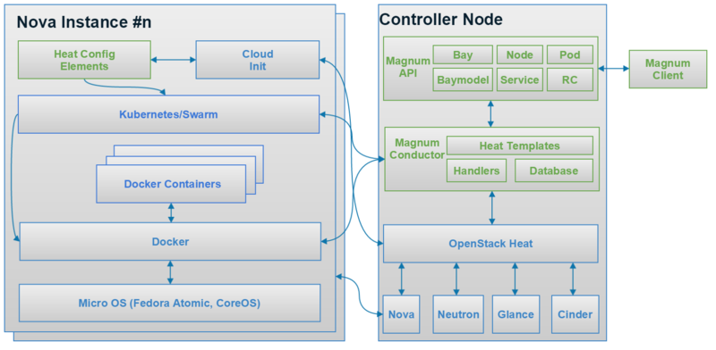

=========
OpenStack
=========

`Developer's Guide <http://docs.openstack.org/infra/manual/developers.html>`_

Intro
=====

The OpenStack Mission: to produce the ubiquitous Open Source Cloud Computing platform that will meet the needs of public and private clouds regardless of size, by being simple to implement and massively scalable. [#]_

OpenStack is open source, openly designed, openly developed by an open community.

Now(July 18, 2015) openstack have 19 main services

- Main services
    - Identity (Keystone)
    - Compute (Nova)
    - Image service (Glance)
    - Networking (Neutron)
    - Object Storage (Swift)
    - Block Storage (Cinder)
    - Orchestration (Heat)
    - Database Service (Trove)
    - Bare Metal (Ironic)
    - Data processing (Sahara)
    - Message service (Zaqar)
    - Key management (Barbican)
    - DNS (Designate)
    - Shared Filesystems (Manila)
    - Containers service (Magnum)
    - Application catalog (Murano)
    - Governance service (Congress)
    - Workflow service (Mistral)
    - Key-value store as a Service (MagnetoDB)
- Supporting services
    - Dashboard (Horizon)
    - Telemetry (Ceilometer)
    - Common Libraries (Oslo)
    - Deployment (TripleO)
    - Command-line client (OpenStackClient)
    - Benchmark service (Rally)
    - Puppet modules (PuppetOpenStack)

Heat
====

Heat is the main project in the OpenStack Orchestration program. It implements an orchestration engine to launch multiple composite cloud applications based on templates in the form of text files that can be treated like code. A native Heat template format is evolving, but Heat also endeavours to provide compatibility with the AWS CloudFormation template format, so that many existing CloudFormation templates can be launched on OpenStack. Heat provides both an OpenStack-native ReST API and a CloudFormation-compatible Query API. [#]_

Horizon
=======

.. sidebar:: Overview

    - PTL: Gabriel Hurley (Nebula)
    - OpenStack web dashboard service
    - horizon can't detect how big volume group is
      

Dependency
----------

- **apache2** -- apache web server
- **memcache** -- mem-cache-d，is a free memory caching system, speed up dynamic database-driven website by caching data in RAM
- **django** -- python based web framework

Congiure file
-------------

- **/opt/stack/horizon/openstack_dashboard/settings.py**
    - ``SESSION_TIMEOUT`` make this val bigger, no need enter password frequently.
- **/opt/stack/horizon/openstack_dashboard/local/local_settings**
    - ``TIME_ZONE`` change defaut time_zone *UTC* to *Asia/Shanghai*

Refresh horizon
---------------
   
.. code-block:: bash

   sudo service {apache2,memcached} restart

`Cinder <https://wiki.openstack.org/wiki/Cinder>`_
==================================================

.. image:: images/cinder_locations.png

.. sidebar:: Overview

    - PTL: Mike Perez
    - Since Folsom, Cinder has replaced Nova-Volume as default block storage service.
    - compare to swift, cinder could provide real time read/write, like a mobile disk
    - it's much cheaper to create a volume than an instance
    - severely rely on RabbitMQ
    - **volume type** -- a type or label can be selected at vol creation time, maps to a set of capabilities of the storage back-end driver to be used for this vol

Components
----------

- **API node** -- provide RESTful API
- **Schedule node** -- communicate between API node & volume node, API node & schedule node normally in same host
- **Volume node** -- provide detachable block storage

Storage backend
---------------

- Local: lvm
- Network: NFS, ceph RBD (RADOS), sheepdog

Configuation
------------

- ``/etc/cinder/cinder.conf``
    - diable dd remove block device -- ``volume_clear = none`` , same configuation as nova' libvirt meta-section

.. code-block:: ini

    [lvmdriver-1]
    volume_clear = none

- ``cinder/setup.cfg`` -- stores all Filters' full path

work flow
---------

create cinder volume
^^^^^^^^^^^^^^^^^^^^

1. client send a create volume request to API node
2. will check whether request is legal, then send request to a schedule node randomly
3. pick up one node from health volume node
4. create volume, then return volume status
5. scheduler return volume status to api node
6. api return volume status to client

.. code-block:: bash
    
    cinder create --hint local_to_instance=instance_uuid --display_name=instance_name SIZE

delete cinder volume
^^^^^^^^^^^^^^^^^^^^

It will cost lots of time, since wipe data permanently is required before remove a volume.
If change volume size manually (not w/ cinder) will cause error deleting.

service management
^^^^^^^^^^^^^^^^^^

.. code-block:: bash
    
    cinder service-list
    cinder service-enable <hostname> <binary>
    cinder service-disable [--reason <reason>] <hostname> <binary>

    

Glance
======

.. image:: images/glance_image_status_transition.png
    :width: 350px

.. code-block:: bash
    :linenos:

    glance image-create --name=<NAME> --store=<STORE> --disk-format=<DISK_FORMAT> \
        --container-format=<CONTAINER_FORMAT> --file=<FILE> --is-public=True [--min-disk=<DISK_GB>]
    glance image-download --file=<OUTPUT_FILE> [--progress] <ImageID>

Mete-data
---------

hw_scsi_model = virtio-scsi or virtio-blk

Sahara
======
 
- It's a PaaS solution by openstack
- provide an abstract implementation layer of BigData Services(hadoop/spark/storm) through 3rd-party plugins(vanilla,cdh,hdp,mapr,spark...)

Neutron
=======

.. sidebar:: Terms

    * **dnsmasq** -- Daemon that provides DNS, DHCP, BOOTP, and TFTP services for virtual networks.

Congiuration Files
------------------

* **/etc/neutron/dhcp_agent.ini** -- configuation file for dhcp_agent service
    * ``dnsmasq_config_file = /etc/neutron/dnsmasq-neutron.conf``
* **/etc/neutron/dnsmasq-neutron.conf** -- self assigned dnsmasq conf file
    * ``dhcp-option-force=26,1400``    # this change will not affect cirros instance's mtu size

Magnum
======

magnum, murano both can manage kubernetes
nova-docker talks directly to docker

- container -- isolated runtime for processess
- services -- tcp port routing to multiple containers
- pod -- grouping of related containers
- bay -- grouping of nodes that run a COE (container orchestration engine like k8s,swarm,etc.)
- baymodel -- template for creating bay

.. sidebar:: Note

    every circle in 'stacks' is a configuration step

.. code-block:: bash

    magnum baymodel-list
    magnum baymodel-show <baymodel>
    magnum bay-create --name k8s_bay --baymodel kubernetes --node-count 2
    magnum bay-list   # created bay list, can be found at horizon/orchestration/stacks
    magnum pod-create --bay k8s_bay --manifest kubernetes/examples/walkthrough/v1beta3/pod1.yaml
    magnum pod-list
    magnum pod-show <pod>
    magnum container-create --json demo.json
    docker logs -f <container>

Developers
==========

Launchpad bug status
--------------------

================== ================================
Name               Description
================== ================================
New                Not looked at yet.
Incomplete         Cannot be verified, the reporter needs to give more info.
Opinion            Doesn't fit with the project, but can be discussed.
Invalid            Not a bug. May be a support request or spam.
Won't Fix          Doesn't fit with the project plans, sorry.
Confirmed          Verified by someone other than the reporter.
Triaged            Verified by the bug supervisor.
In Progress        The assigned person is working on it.
Fix Committed      Fixed, but not available until next release.
Fix Released       The fix was released.
================== ================================

Terminologies
=============

| **sheepdog** -- opensourcs project, developed by NTT, design for vm's storage.
| **fuel** -- auto deploy openstack enviroment
| **murano**-- auto install openstack plugin
| `ceilometer quick start <https://www.rdoproject.org/CeilometerQuickStart>`_
|

Resources
=========

`OpenStack useage statistics <http://superuser.openstack.org/articles/openstack-users-share-how-their-deployments-stack-up>`_

.. [#] https://wiki.openstack.org/wiki/Main_Page
.. [#] https://wiki.openstack.org/wiki/Heat
