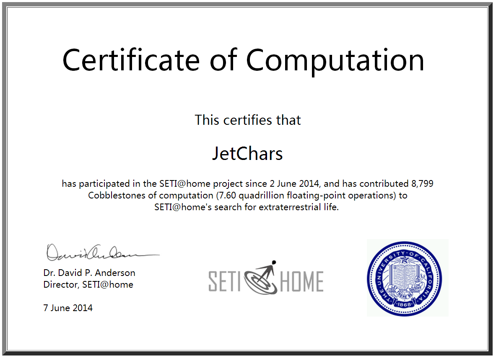

==================
Jet Chars's Resume
==================

.. image:: images/pku_logo.png
    :align: right

Contact Me
==========
* Email : calebjay@live.cn
* Tel : +86 181-0793-5886
* Homepage : http://jetchars.github.io

Education Background
====================
* Master's Degree : Peking University *Software Engineering*
* Bachelor's Degree : Nankai University *Basic Chemistry*

InternShip
==========

Project Experiences
===================

2014.4~now The Study of BigData-on-Cloud Solutions and Technology(Peking University)
y
- Big Data(e.g. Hadoop,spark,storm,tachyon) Technology Study
- OpenStack Environment Deployment
- Performance Testing for Big Data on Cloud Platform
- Other Emerging Technology Study 

2014.8~2014.11 Conditional Randon Field based NLP Study (Essex Lake Group)

2014.11~now Hadoop as a Service Proof of Concept (Intel APAC R&D Ltd.)
- Performance testing & Develop testing tools doopshot(github)
- Integration with docker/nova
- sahara optimization and edp study

Basic Skills
============
* Programing Languages: ``python`` ``c`` ``java`` 
* Marking Languages: ``Markdown`` ``reStructedText`` ``HTML``
* ``Linux development`` ``SQL`` ``QT``

Interested Areas
================
* Cloud Computing: ``OpenStack`` ``Spark`` ``Storm`` ``Docker``
* Machine Learning: ``Nature Language Processing``

